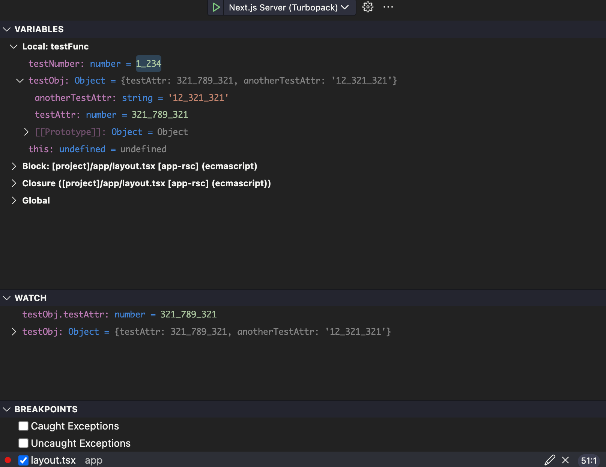

# underscore-number-debug-panel-formatter
A VS Code extension to automatically convert numeric values to use underscore separators in the debug panel UI—covering variables, watch expressions, and collapsed object previews. Improves number readability without any manual intervention.

## Example code

## Debug Panel

This extension is built with the [VS Code Extension Generator](https://github.com/microsoft/vscode-extension-generator).

# Instructions:
1. Install the extension from the VS Code Marketplace.
2. Enable the extension in the VS Code settings.
3. Restart VS Code.
4. Debug your code and see the numbers formatted with underscores in the debug panel UI.

# Build it yourself:
1. Clone the repository.
2. In the project folder, run `npm install` to install the dependencies.
3. In the project folder, run `npx vsce package` to build the extension.
4. From the command panel in VS Code, search for "Install from VSIX" and select it.
5. Navigate to the project folder and select the `extension.vsix` file.
6. Enable the extension in the VS Code settings.
7. Restart VS Code.
8. Debug your code and see the numbers formatted with underscores in the debug panel UI.
